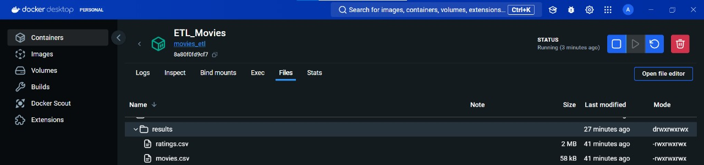

# Movies ETL Project

## Overview

The **Movies ETL Project** is a Python-based ETL (Extract, Transform, Load) pipeline that processes movie rating data. The project uses Docker to containerize the environment, ensuring the ETL process runs smoothly across different setups.

## Features

- **Extract**: Load movie ratings and movie details from local files.
- **Transform**: Process and clean the data into DataFrames.
- **Load**: Export the cleaned data into CSV files.
- **Dockerized**: The entire process runs inside a Docker container, ensuring a consistent environment across platforms.

## How to Use

1. **Set Up the Docker Environment**:
   - Ensure Docker is installed and running on your machine.
   - Build the Docker image using:
     ```sh
     docker build -t movies_etl .
     ```

2. **Run the ETL Process**:
   - Run the Docker container with the following command:
     ```sh
     docker run -v /path/to/your/local/folder:/results movies_etl
     ```
   - Replace `/path/to/your/local/folder` with the path to the folder on your machine where the results should be stored.
   - The results will be saved as `ratings.csv` and `movies.csv` inside the `/results` folder.

3. **Access the Files in Docker Desktop**:
   - You can view the output CSV files in Docker Desktop by checking the `Files` tab in the running container.

   

4. **Stop and Remove the Container**:
   - To stop the container, simply press `CTRL + C` or run:
     ```sh
     docker stop <container_name>
     ```
   - To remove the container after stopping, use:
     ```sh
     docker rm <container_name>
     ```

## Requirements

- **Python 3.9** (Docker container includes this)
- **Libraries**: pandas, numpy
  - These will be installed automatically in the Docker container via `requirements.txt`.

## Project Files

- **`helper.py`**: Contains the `local_storage` class responsible for loading and processing the ratings and movies files.
- **`movies_etl.py`**: The main ETL script that extracts, processes, and exports the data.
- **`Dockerfile`**: Defines the Docker container environment and specifies how to run the ETL script.
- **`requirements.txt`**: Lists the necessary Python dependencies.

## Docker Commands

- **Build the Image**:
  ```sh
  docker build -t movies_etl .
## Run the Container:
  ```sh
  docker run --name ETL_Movies -v /path/to/local/folder:/results movies_etl
